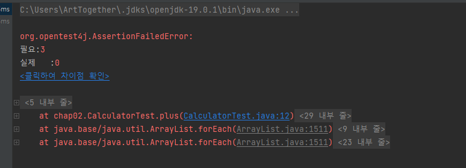
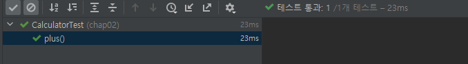
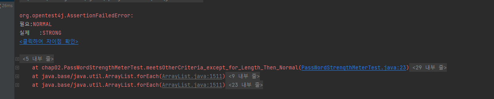

# Chapter2

## TDD 시작

### TDD 이전의 개발

1. 만들 기능에 대해 설계 고민
    - 어떤 클래스와 인터페이스를 도출할지 고민하고 각 타입에 어떤 메서드를 넣을지 시간을 들여 생각.
2. 과정1을 수행하면서 구현에 대해서도 고민, 대략 어떻게 구현하면 될지 머릿속에 그려지면 코드르 쓰기 시작
3. 기능에 대한 구현을 완룧나 것같으면 기능을 테스트. 이 과정에서 원하는 대로 동작 하지 않거나 문제가 발생하면 과정2에서 작성한 코드를 디버깅하면서 원인을 찾는다.

- 코드를 작성하는 개발자와 테스트하는 개발자가 다를 때도 있다.
- 테스트 과정이 어렵다. ( 매번 톰캣 서버를 구동해야 한다.)
- 미리 DB 세팅이 되어 있어야 한다.

|한번에 코드 구현 | ->  | 테스트 | ->  | 디버깅 <br> 코드 수정 |
|--------------|-----|-------|-----|---------------------|

### TDD 란 ?

- TDD는 테스트부터 시작한다. ( 선 테스트 후 구현 )
    - 구현 코드가 없는데 어떻게 테스트를 하는가? 기능이 올바르게 동작하는지 검증하는 테스트 코드를 작성한다는 것을 의미.
    - 기능을 검증하는 테스트 코드를 먼저 작성 하고 테스트를 통과시키기 위해 개발을 진행한다.
    - 이해를 돕기 위해 간단한 덧셈 기능을 TDD로 구현

```java
package chap02;

import org.junit.jupiter.api.Test;

public class CalculatorTest {

    @Test
    void plus() {
        int result = chap02.Calculator.plus(1, 2);
        assertEquals(3, result);
    }
}
```

- Caculator 클래스가 없다는 컴파일 에러 발생.
    - Junit은 `@Test` 어노테이션을 붙인 plus() 메서드를 테스트 메서드로 인식한다 . 테스트 메서드는 기능을 검증하는 코드를 담고 있는 메서드
    - 계산기능을 실행하는 코드를 작성한다.
    - 계산기능을 실행한 결과가 기대 값인지를 검증한다. assertEquals() 메서드는 인자로 받은 두 값이 동일한지 비교.
    - 첫 번째가 기대 값, 두 번째가 실제 값.동일하지 않으면 `AssestionFailedError`가 발생한다.<br>
- 아직 존재하지 않는 chap02.Calculator 클래스와 plus 메서드를 사용해서 작성과 비롯 몇 가지 고민
    - 메서드 이름은 `plus`가 좋을까? 아니면 `sum`이 좋을까?
    - 덧셈 기능을 제공하는 메서드는 파라미터가 몇 개여야 할가? 파라미터의 타입은? 반환값은?
    - 메서드를 정적 메서드로 구현할까 인스턴스 메서드로 구현할까?
    - 메서드를 제공할 클래스 이름은 무엇이 좋을까?
- 더하기 부호르 의미하니 plus 로 결정
- 두 값을 더해야하니 파라미터는 두 개.
- 현재는 덧셈을 기능 구현하기 위해새로운 객체를 만들 필요가 없다. 나중에 어떤 기능이 추가될지 모르지만 지금 당장은 정적 메서드로 충분할것 같아 plus를 정적 메서드 이름으로 정했다.<br><br>
- plus 메서드를 제공할 클래스 이름은 단순히 계산기를 의미하는 Calculator로 정했다.

```java
package chap02;

public class chap02.Calculator{
public static int plus(int a1,int a2){
        return 0;
        }
        }
```



- 에러가 발생
    - `Expected : 3`와 `Actual : 0`

- 이 테스트를 통과 시키는 가장 쉬운 방법으로 `plus()`메서드를 아래와 같이 구현

```java
package chap02;

public class chap02.Calculator{
public static int plus(int a1,int a2){
        return 3;
        }
        }
```

- TDD 를 접할 때는 이런 작은 단계를 무시하지 말 것.
  
- 아래와 같이 경우의 수 추가

```java
    @Test
    void plus(){
            int result=chap02.Calculator.plus(1,2);
            assertEquals(3,result);
            assertEquals(5,chap02.Calculator.plus(4,1));
            }
            }
```

```java
    public static int plus(int a1,int a2){
        if(a1==4&&a2==1)return 5;
        else return 3;
        }
```

->

```java
    public static int plus(int a1,int a2){
        return a1+a2;
        }
```

- 아직 하나가 남았다. 코드 경로를 유심히 보면 `chap02.Calculator.java` 가 `src/test/java`소스 폴더에 위치해 있다.
- chap02.Calculator 클래스를 `src/main/java`소스 폴더에 만들어도 되지만 아직 완성된 기능이 아니므로 `src/test/java` 소스 폴더에 넣었다.
- 덧셈 기능을 완료 했으므로 chap02.Calculator 클래스를 `src/test/java` 소스 폴더에서 `src/main/java` 소스 폴더로 이동 시켜서 배포 대상에 포함 시킨다.
- 코드를 이동 시키고 CalculatorTest 클래스를 실행해서 테스트에 통과하는지 다시 한번 확인.

<details><summary style="color: cornflowerblue"><b>Note</b></summary>
> `src/test/java` 소스 폴더는 배포 대상이 아니므로 `src/test/java` 폴더에 코드를 만들면 완성되지 않은 코드가 배포되는 것을 방지하는 효과가 있다.
</details>

- TDD 는 기능을 검증하는 테스트 코드를 먼저 만든다고 했다. 덧셈 예제에서는 덧셈 기능을 검증하는 테스트 코드를 먼저 작성.
    - 이 과정에서 테스트 대상이 될 클래스 이름, 메서드 이름, 파라미터 개수, 리턴 타입을 고민했다.
    - 새로운 객체를 생성할지 아니면 정적 메서드로 구현할지 등을 함께 고민했다.
- 테스트 코드 작성 후 컴파일 오류를 없애는 데 필요한 클래스와 메서드를 작성.
    - 테스트 실행
    - 테스트 실패
    - 실패한 이유를 확인
    - 단순히 3을 리턴해서 테스트를 통과할 만큼만 코드 구현
    - 실패 테스트를 통과 후 새로운 테스트를 추가 .
    - 추가한 테스트를 통과시키기 위한 코드를 작성.
    - TDD는 테스트를 먼저 작성하고 테스트에 실패하면 테스트를 통과시킬 만큼 코드를 추가하는 과정을 반복하며 점진적으로 기능을 완성.

### TDD 예: 암호 검사기

- 암호 검사기는 문자열을 검사해서 규칙을 준수하는지에 따라 암호를 '약함', '보통', '강함'으로 구분
- 다음 규칙을 이용해서 암호를 검사할 것.
    1. 길이가 8글자 이상
    2. 0부터 9사이의 숫자를 포함
    3. 대문자 포함

    - 세 규칙을 모두 충족하면 강함
    - 두 개의 규칙을 충족하면 보통
    - 1개 이하의 규칙을 충족하면 약함.
- 먼저 테스트할 기능의 이름을 정하면 약함/ 보통/ 강함은 암호 등급이라고 생각할 수 있으므로 `PassWordLevel`이라는 단어를 사용할 수 있다.
- 등급 대신 강도라는 의미로 `PasswordStrength`라는 단어를 사용할 수도 있다.
  <br><br>
- 검사한다는 의미를 표현할 적정한 단어를 찾기 위해 구글과 사전을 검색해보니 Checker보다는 Meter를 더 많이 사용
- `PasswrodStrengthMeter`를 선택.

```java
public class PassWordStrengthMeterTest {

    @Test
    void name() {

    }
}
```

- 아무 검증도 하지 않는 의미 없는 테스트 메서드를 하나 생성
- 이 상태에서는 테스트를 실행한다. 당연히 통과
- 빈 테스트 메서드를 실행하는 것이 불필요한 행위 같아 보여도 테스트를 실행할 수 있는 환경이 갖추어져 있는지 확인 가능

### 첫 번째 테스트: 모든 규칙을 충족하는 경우

- 첫 번째 테스트를 만들어보자
- 첫 번째 테스트를 잘 선택하지 않으면 이후 진행 과정이 순탄하게 흘러가지 않는다.
- 첫 번째 테스트를 선택할 때에는 가장 쉽거나 가장 예외적인 상황을 선택해야 한다.
- 암호 검사 기능에서 가장 쉽거나 가장 예외적인 것은?
    - 모든 규칙을 충족하는 경우
    - 모든 조건을 충족하지 않는 경우
- 모든 조건을 충족하지 않는 경우를 생각해보자.
    - <b style="color:aqua" >모든 조건을 충족하지 않는 테스트를 통과 시키려면 각 조건을 검사하는 코드를 모두 구현해야 한다.</b>
    - 한 번에 만들어야 할 코드가 많아지므로 첫 번째 테스트 코드를 통과하는 시간도 길어지낟.
    - 사실상 구현을 다하고 테스트를 하는 방식과 다르지 않다.
      <br>
- 모든 규칙을 충족하는 경우는?
    - 테스트를 쉽게 통과 시킬 수 있다. 그러니 모든 조건을 충족하는 경우를 먼저 테스트 코드로 작성해보자.
      <br><br>
- '암호가 모든 조건을 충족하면 암호 강도는 강함이어야함.' 을 의미하는 문장을 테스트 메서드의 이름으로 사용하고 싶다.
- `If the passwrod meets all the criteria then the strength should be strong` 이라는 문장이 너무 길다.

```
값타입 결과 : meter.meter(`ab12!@AB`);
assertEquals("기대값", 결과);
```

- 이 코드를 완성하려면 PasswordStrengthMether#meter() 메서드의 리턴 타입을 결정해야 한다.  
  결과 값은 암호의 강도이므로 int 탕비 사용. ex) 0이면 약함 , 1이면 보통, 2이면 강함이라고 함.
- 또는 PasswordStrength.STRONG 형태의 열거 타입을 사용할 수도있다.
- 2와 같은 같은 값보다는 PassWordStrength과 같은 열거 타입 값이 암호 강도를 더 잘 표현하므로 이 예제에서는 테스트 코드를 아래와 같이 작성했다.
```java
package chap02;

import org.junit.jupiter.api.Test;

public class PassWordStrengthMeterTest {

    @Test
    void meetsAllCriteria_Then_Strong() {
        PassWordStrengthMeter meter = new PassWordStrengthMeterMeter();
        PassWordStrengthMeter result = meter.meter("ab12!@AB");
        assertEquals(PassStrength.STRONG,result);
    }
}
```
<details><summary style="color: cornflowerblue"><b>Note</b></summary>

> Assertions.asserEqualEqual() 메서든느 두 값이 같은지 비교하는 단언 (assertion)이다.
> 단언은 값이 특정 조건을 충족하는지 확인하고 충족하지 않는 경우 익셉션을 발생시킨다.
> Junit 테스트 코드는 Assertions가 제공하는 여러 메서드를 이용해서 단언을 실행한다.
> 단언을 통과하지 못하고 익셉션이 발생하면 이를 테스트에 실패했다고 한다.

</details>

- PasswordStrengthMeter 타입과 PasswordStrength 타입이 존재하지 않으므로 컴파일 에러가 발생한다.
- 컴파일 에러를 먼저 없앤다.
```java
public enum PasswordStrength {
    STRONG
}
```
- STRONG  외에 WEAK 나 NORMAL을 미리 추가할 수도 있지만, TDD는 테스트를 통과시킬 만큼의 코드를 작성한다.
- 테스트 메서드를 통과시킬 만큼의 코드를 작성한 것이다.
```java
public class PassWordStrengthMeter {
    public PasswordStrength meter(String s){
        return null;
    }
}
```
- 컴파일 에러를 없앴으니 테스트를 실행할 수 있다. 실행 결과는 다음과 같다. 기대한 값이 STRONG인데 실제 값은 null이어서 테스트에 실패했음을 알 수 있다.
- 테스트를 통과하는 간단한 방법을 진행해본다.
```java
public class PassWordStrengthMeter {
    public PasswordStrength meter(String s){
        return PasswordStrength.STRONG;
    }
}
```
- 테스트를 통과를 한다.
- `meetsAllCriteria_Then_Strong()` 테스트 메서드에 모든 규칙을 충족하는 예를 하나 더 추가하자.

```java
package chap02;

import org.junit.jupiter.api.Test;

import static org.junit.jupiter.api.Assertions.assertEquals;

public class PassWordStrengthMeterTest {

    @Test
    void meetsAllCriteria_Then_Strong() {
        PassWordStrengthMeter meter = new PassWordStrengthMeter();
        PasswordStrength result = meter.meter("ab12!@AB");
        assertEquals(PasswordStrength.STRONG,result);

        PasswordStrength result2 = meter.meter("abc1!Add");
        assertEquals(PasswordStrength.STRONG,result2);
    }
}
```

### 두번째 테스트 : 길이만 8글자 미만이고 나머지 조건을 충족하는 경우
- 문자열의 길이가 8글자 미만이고 나머지 조건은 충족하는 암호.
- 이 암호의 강도는 보통이어야 한다.
```java
    @Test
    void meetsOtherCriteria_except_for_Length_Then_Normal() {
            PassWordStrengthMeter meter = new PassWordStrengthMeter();
            PasswordStrength result = meter.meter("an12!@A");
            assertEquals(PasswordStrength.NORMAL, result);
            }
```
- 컴파일 에러를 없앤다.
```java
package chap02;

public enum PasswordStrength {
    NORMAL, STRONG
}
```

- 테스트를 통과하게끔만 만들어준다.
```java
package chap02;

public class PassWordStrengthMeter {
    public PasswordStrength meter(String s){
        return PasswordStrength.NORMAL;
    }
}
```
```java
package chap02;

public class PassWordStrengthMeter {
    public PasswordStrength meter(String s) {
        if (s.length() < 8) return PasswordStrength.NORMAL;
            return PasswordStrength.STORNG;
    }
}
```

### 세 번째 테스트 : 숫자를 포함 하지 않고 나머지 조건은 충족하는 경우
```java
    @Test
    void meetsOtherCriteria_except_for_number_Then_Normal() {
        PassWordStrengthMeter meter = new PassWordStrengthMeter();
        PasswordStrength result = meter.meter("ab!@ABqwer");
        assertEquals(PasswordStrength.NORMAL,result);
    }
```
- 내용 구현
```java
package chap02;

public class PassWordStrengthMeter {
    public PasswordStrength meter(String s) {
        if (s.length() < 8) return PasswordStrength.NORMAL;
        boolean containsNum = false;
        for (char ch : s.toCharArray()) {
            if (ch >= '0' && ch <= '9') {
                containsNum = true;
                break;
            }
        }
        return !containsNum ? PasswordStrength.NORMAL : PasswordStrength.STRONG;
    }
}
```
- 위 코드에서 숫자 포함 여부 확인을 하는 코드를 메서드로 추출해서 가독성을 개선하자.
```java
package chap02;

public class PassWordStrengthMeter {
    public PasswordStrength meter(String s) {
        if (s.length() < 8) return PasswordStrength.NORMAL;
        boolean containsNum = meetsContainingNumberCriteria(s);
        return !containsNum ? PasswordStrength.NORMAL : PasswordStrength.STRONG;
    }

    private boolean meetsContainingNumberCriteria(String s) {
        for (char ch : s.toCharArray()) {
            if (ch >= '0' && ch <= '9') {
                return true;
            }
        }
        return false;
    }
}
```
### 코드 정리 : 테스트 코드 정리
- 각 테스트 메서드를 보면 다음과 같은 형태를 갖는다.
```java
@Test
void 메서드이름 (){
    PasswordStrengthMeter meter = new PasswordStrengthMeter();
    PasswrodStrength result = meter.meter(암호);
    assertEquals(PasswroldStrength.값, result);
        }
```
- 테스스 코드도 코드이기 때문에 유지보수 대상이다. 즉 테스트 메서드에서 발생하는 중복을 알맞게 제거하거나 의미가 잘 드러나게 코드를 수정할 필요가 있다.
- 먼저 PasswordStrengthMeter 객체를 생성하는 코드의 중복을 없애보자 .
- 지금은 각 메서드에서 생성하고 있는데 다음 코드처럼 필드에서 생성하도록 수정할 수 있다.
```java
package chap02;

import org.junit.jupiter.api.Test;

import static org.junit.jupiter.api.Assertions.assertEquals;

public class PassWordStrengthMeterTest {

  private PassWordStrengthMeter meter = new PassWordStrengthMeter();

  @Test
  void meetsAllCriteria_Then_Strong() {
    PasswordStrength result = meter.meter("ab12!@AB");
    assertEquals(PasswordStrength.STRONG, result);

    PasswordStrength result2 = meter.meter("abc1!Add");
    assertEquals(PasswordStrength.STRONG, result2);
  }

  @Test
  void meetsOtherCriteria_except_for_Length_Then_Normal() {
    PasswordStrength result = meter.meter("an12!@A");
    assertEquals(PasswordStrength.NORMAL, result);
  }

  @Test
  void meetsOtherCriteria_except_for_number_Then_Normal() {
    PasswordStrength result = meter.meter("ab!@ABqwer");
    assertEquals(PasswordStrength.NORMAL,result);
  }
}
```
- 코드 수정후 테스트를 다시 실행하여 통과하는지 확인. 
- 암호 강도 측정 기능을 실행하고 이를 확인하는 코드도 정리 대상
```java
PasswordStrength result = meter.meter(암호);
assertEquals(기댓값, result);
```
- 이런 부류의 중복은 메서드를 이용해서 제거할 수 있다. 먼저 assertStrength 메서드를 다음과 같이 추가한다.
- 이 메서드는 password 파라미터의 강도를 구하고 그 값이  expStr 파라미터와 같은지를 비교 한다.
```java
    private void assertStrength(String password, PasswordStrength expStr) {
        PasswordStrength result = meter.meter(password);
        assertEquals(expStr, result);
    }
```
```java
package chap02;

import org.junit.jupiter.api.Test;

import static org.junit.jupiter.api.Assertions.assertEquals;

public class PassWordStrengthMeterTest {

    private PassWordStrengthMeter meter = new PassWordStrengthMeter();

    private void assertStrength(String password, PasswordStrength expStr) {
        PasswordStrength result = meter.meter(password);
        assertEquals(expStr, result);
    }

    @Test
    void meetsAllCriteria_Then_Strong() {
        assertStrength("ab12!@AB", PasswordStrength.STRONG);
        assertStrength("abc1!Add", PasswordStrength.STRONG);
    }

    @Test
    void meetsOtherCriteria_except_for_Length_Then_Normal() {
        assertStrength("an12!@A", PasswordStrength.NORMAL);
    }

    @Test
    void meetsOtherCriteria_except_for_number_Then_Normal() {
        assertStrength("ab!@ABqwer", PasswordStrength.NORMAL);
        PasswordStrength result = meter.meter("ab!@ABqwer");
    }
}
```
<details><summary style="color: cornflowerblue"><b>Note</b></summary>

> 테스트 코드의 중복을 무턱대고 제거하며 안 된다. 중복을 제거한 뒤에도 테스트 코드의 가독성이 떨어지지 않고 수정이 용이한 경우에만 중복을 제거해야 한다.  
중복을 제거하 뒤에 오히려 테스트 코드 관리가 어려워진다면 제거했던 중복을 되돌려야 한다.
</details>

### 네 번쨰 테스트 : 값이 없는 경우
- 예를 들어 meter() 메서드에 `null`을 전달 하면 NPE 가 떨어진다.
- 우리가만들고 있는 암호 강도 측정기는 `null`에 대해서도 알맞게 동작해야 한다.
- null을 입력할 경우 암호 강도 측정기는 어떻게 반응해야 할까 
  - `IllegalArgumentException`을 발생.
  - 유효하지 않은 암호를 의미하는 `PasswordStrength.INVALID`를 리턴
- 검증하는 테스트 코드를 먼저 추가한다.  
```java
    @Test
    void nullInput_Then_Invalid(){
        assertStrength(null,PasswordStrength.INVALID);
    }
```
```java
    @Test
    void emptyInput_Then_Invalid(){
        assertStrength("", PasswordStrength.INVALID);
    }
}
```
- 실패한다.

```java
package chap02;

public class PassWordStrengthMeter {
    public PasswordStrength meter(String s) {
        if (s == null || s.isEmpty()) return PasswordStrength.INVALID;
        if (s.length() < 8) return PasswordStrength.NORMAL;
        boolean containsNum = meetsContainingNumberCriteria(s);
        return !containsNum ? PasswordStrength.NORMAL : PasswordStrength.STRONG;
    }

    private boolean meetsContainingNumberCriteria(String s) {
        for (char ch : s.toCharArray()) {
            if (ch >= '0' && ch <= '9') {
                return true;
            }
        }
        return false;
    }
}
```

